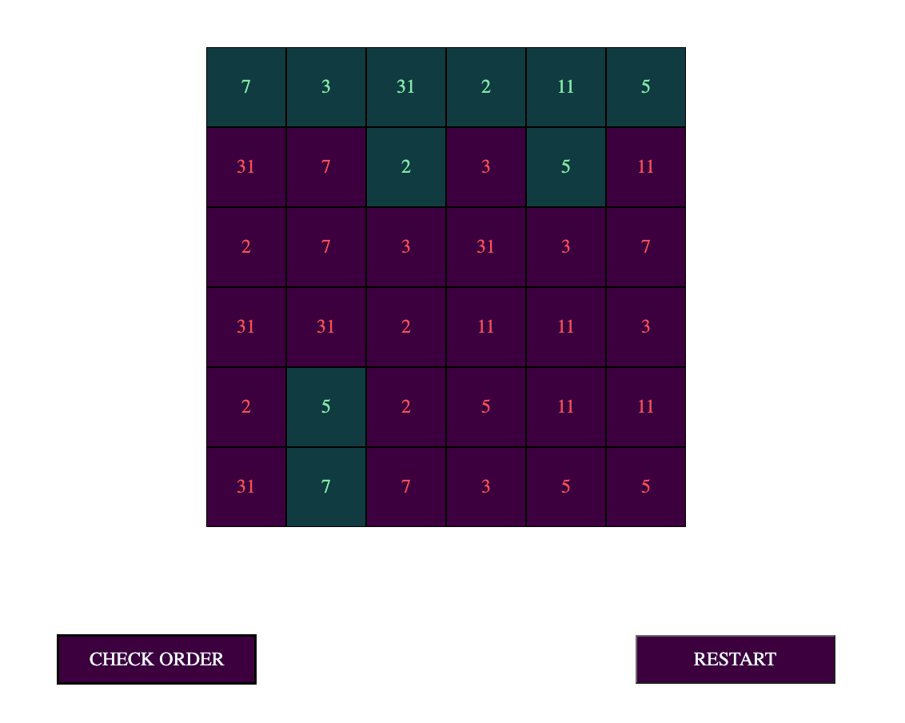

# PRIME-59
The aim of the game is to get each row and column to equal 59

 

## How It's Made:

**Tech used:** HTML, CSS and Vanilla JavaScript

This game is not fully complete but it does still work 

## Play the Game 

You can access this webapp by clicking here: [Prime 59](https://kolourr.github.io/prime59/) 

